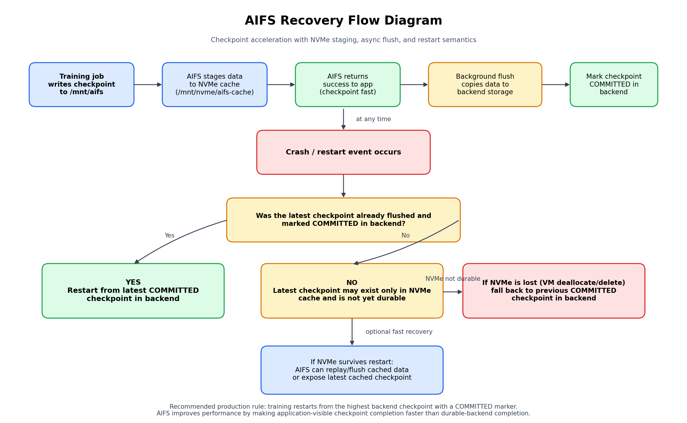

# AI Accelerator (AIFS) — Product & Architecture Overview

*Phase 1, Task 1 deliverable — Intern Project Plan. Written for a reader with no prior exposure to the project.*

---

## 1. What it is, and the problem it solves

**AIFS (binary: `ckptfs`) is a checkpoint-acceleration filesystem for AI training clusters.** It is a userspace (FUSE) filesystem, written in C for Linux, that presents one ordinary POSIX mount point and hides a two-tier storage strategy behind it:

> **Local-speed writes and hot reads, with durable shared storage underneath — exposed through a single POSIX filesystem.**

The problem: large AI training jobs periodically stop to save a **checkpoint** — model weights plus optimizer state, typically **10–100+ GiB, written every 5–60 minutes**. Today those writes go straight to durable shared storage (NFS, Azure NetApp Files, Dell), which is reliable but slow. While the checkpoint writes, **the GPUs sit idle**. On a modern cluster, that stall is real money: at H100 rates ($2.49–$2.69/GPU-hr), a single large checkpoint can burn ~$5 of idle GPU per event — multiplied by checkpoint frequency, cluster size, and run length.

**The core insight: this is not a storage problem — it's a GPU-efficiency problem.** AIFS **decouples performance from durability**: writes land on fast local NVMe first (training resumes immediately), and AIFS replicates the data to durable storage in the background. No application changes — the training job just writes to a normal directory.

## 2. Who it's for

| Persona | Pain today | What AIFS gives them |
|---|---|---|
| **AI Training Engineer** | Training stalls during checkpoint saves | Checkpoints complete at NVMe speed; GPUs resume sooner |
| **HPC / Platform Operator** | Expensive shared storage sized for peak write bursts | NVMe absorbs bursts; durable tier can be right-sized |
| **EDA / Genomics Workflow Owner** | Slow intermediate-file I/O on shared filesystems | Same accelerate-then-replicate pattern for transient data |
| **GPU Cloud Provider** (CoreWeave, Lambda, RunPod class) | Idle GPU time reduces effective sellable utilization | Estimated 5–20% effective utilization improvement |

## 3. How it works today (implemented prototype)

The prototype runs as `./ckptfs <mountpoint> <lower_root> <spool_root>` — three directories, one illusion:

| Role | Example | What it is |
|---|---|---|
| **Mountpoint** | `/mnt/aifs` | The virtual filesystem apps see; nothing stored here |
| **Spool** (upper) | `/mnt/nvme/aifs-cache` | Fast local NVMe — all new writes land here first |
| **Lower** | NFS share (or `/tmp/aifs-backend` in demos) | Durable storage — the source of truth after a crash |

**Write path** (the heart of the system):
1. `create`/`write` → file goes to the **spool** at NVMe speed.
2. `fsync` → spool file is made locally durable, a **background replication job** is queued, and the call returns. *The application is unblocked here — this is the entire performance win.*
3. A background replicator thread copies the file to the lower tier via an **atomic** `copy → rename → fsync` sequence.
4. When **every** file under a checkpoint's directory is durable on the lower tier, AIFS writes a hidden **`.aifs_committed` marker** into that directory — "this whole checkpoint is complete and trustworthy."

**Read path:** spool first, fall back to lower (the same upper/lower idea as overlayfs).

**Crash recovery** is deliberately conservative: on restart, the entire spool is quarantined and only lower-tier checkpoint directories bearing `.aifs_committed` are trusted. A checkpoint that was mid-replication at crash time never receives its marker, so training resumes from the *previous* committed checkpoint. Correctness is bought by sacrificing the newest (possibly incomplete) checkpoint. See `docs/Design/aifs_recovery_flow_diagram.png` for the full decision flow:

## 4. Measured performance

Measured on an Azure **Standard L8as_v3** VM (8 vCPU, 64 GiB, local NVMe), using `dd` with a 4 GiB file (transcript in the README):

| Path | Throughput | Meaning |
|---|---|---|
| Raw NVMe direct | **3,200 MB/s** | Hardware ceiling |
| AIFS async path (no fsync) | **1,400 MB/s** | FUSE-layer cost visible |
| AIFS durable path (fsync) | **879 MB/s** | 4 GiB checkpoint locally durable in **4.9 s** |
| Backend arrival | ~30–40 s later | Replication happens off the critical path |

For contrast: the same 4 GiB written synchronously through a ~100 MB/s NFS mount would hold the critical path for ~46 seconds. The savings compound: *seconds saved per checkpoint × checkpoints per day × GPUs per node × $/GPU-hour* — quantified interactively at the **[AIFS Pricing Calculator](https://aifs-calculator.vercel.app/)**.

## 5. Benefits & differentiators

**Key capabilities** (from the functional spec): faster checkpoint/transient writes · faster restart and hot reads · better cost/performance from existing storage · single-node simplicity · **transparent adoption — no application changes** · workflow-aware extensibility (checkpoint semantics, not just caching).

**Against the competitive field** (WEKA, VAST, DAOS, JuiceFS, Alluxio, Hammerspace, raw NFS/cloud file services, and framework-level async checkpointing like PyTorch DCP / Azure Nebula):

- **vs. managed file services (EFS/ANF):** they give durability; AIFS adds performance *on top of them* rather than replacing them — your existing durable storage remains the source of truth.
- **vs. parallel-filesystem platforms (WEKA/VAST):** those are larger platform decisions with dedicated clusters and pricing to match. AIFS is a lightweight per-node layer you can pilot on one training pipeline.
- **vs. generic caches (Alluxio/JuiceFS):** AIFS is not just a cache — it is a cache **plus** write buffer **plus** durability orchestrator **plus** checkpoint-aware policy layer (commit markers, recovery semantics).
- **vs. framework async checkpointing (PyTorch DCP async):** framework solutions require adopting specific APIs per framework; AIFS works at the filesystem layer for any tool that writes files.

## 6. Target architecture (specified, on the roadmap — not yet implemented)

The engineering spec and publish-coherence model define where the product is headed. These are **design targets, not shipping code**:

- **Chunked storage** — files as 64–128 MB chunks with per-chunk dirty tracking, generation counters, and priority-ordered flushing (shutdown → fsync → checkpoint → eviction → capacity → aged → background).
- **Chunk-granular eviction** so the NVMe cache can exceed its capacity gracefully.
- **Multi-node publish/coherence model** — instead of building distributed cache coherence, AIFS eliminates the need for it: nodes work on private local state and make results globally visible only at an explicit **publish boundary** (`aifs publish <dir>`), with a `WORKING → FLUSHING → PUBLISHING → PUBLISHED` state machine. The current single-node `.aifs_committed` marker is the primitive version of this model.
- **Persistent journal + full crash-recovery scan, metrics, Kubernetes/CSI integration.**

## 7. Current limitations (honest assessment)

The shipping binary is a **single-node, whole-file-granularity MVP** — a working proof of the core mechanism, not a production filesystem:

- 9 FUSE operations implemented; **no `unlink`, `rename`, `truncate`, or `rmdir`** from the application side.
- **Journal is in-memory only** (4,096 entries, never freed) — it evaporates on crash; recovery relies entirely on the conservative quarantine + commit-marker rule.
- After a restart, `ls` on the mount shows an empty directory even though committed checkpoints exist in the lower tier (readdir lists only the spool — known defect).
- Writing to a file that exists only in the lower tier bypasses the spool (slow path, replication then fails for it).
- Single replication thread; a full replication queue (1,023 slots) surfaces as `EIO` on `fsync`.
- Quarantined orphan spool directories accumulate and must be cleaned manually.
- Requires **Linux + libfuse3**; will not build on macOS. FUSE itself costs throughput (3,200 → 1,400 MB/s on the async path) — known optimization levers: FUSE writeback cache, larger `max_write`, `copy_file_range()`, multiple replication workers.
- Checkpoints must each live under their **own top-level directory** on the mount for commit markers to work; there is no test suite yet.

---

**Bottom line:** AIFS demonstrates, with a working prototype and measured numbers, that checkpoint I/O can be taken off the GPU critical path with zero application changes — and it frames that win in the currency that matters: **avoided idle-GPU dollars.** The specs chart a credible path from this MVP to a chunked, multi-node, publish-coherent product.
