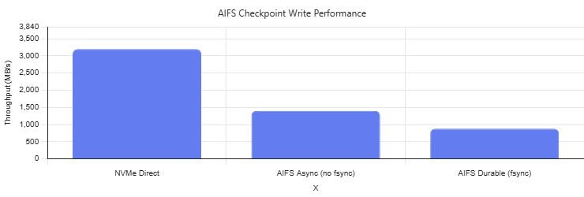
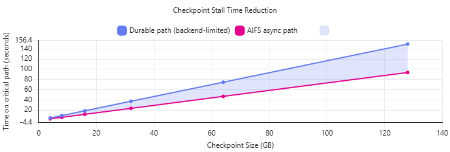
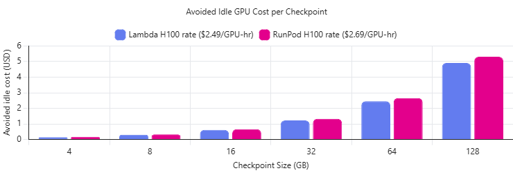

## 📊 Benchmark Results

The following charts summarize the preliminary benchmark results for **AIFS (AI File System Accelerator)** using the measured `dd`/FUSE numbers from the prototype environment.

### Test Summary

- **NVMe Direct:** 3,200 MB/s
- **AIFS Async (no fsync):** 1,400 MB/s
- **AIFS Durable (fsync):** 879 MB/s

These results show how AIFS uses local NVMe as a fast write-back layer to reduce checkpoint stalls and improve effective GPU utilization.

---

## 1. Checkpoint Write Throughput

This chart compares the measured write throughput across the direct NVMe path and the AIFS paths.



### Key takeaway
- **NVMe Direct** shows the maximum local-device throughput.
- **AIFS Async** demonstrates the fast-acknowledgment path enabled by write-back buffering.
- **AIFS Durable** reflects the backend-limited durability path.

> **Why it matters:** AIFS allows checkpoint writes to complete much faster on the training critical path than the durable/backend-limited path.

---

## 2. Checkpoint Stall Time Reduction

This chart models checkpoint stall time as checkpoint size increases, using the measured throughput results above.



### Key takeaway
- As checkpoint size increases, the gap between the **durable path** and the **AIFS async path** becomes more significant.
- This translates directly into **less time spent waiting on storage** during training.

> **Example:** At larger checkpoint sizes, AIFS can remove tens of seconds from each checkpoint event.

---

## 3. Avoided Idle GPU Cost per Checkpoint

This chart translates the time savings into an illustrative GPU cost savings model for a large H100 cluster.



### Key takeaway
- Even modest checkpoint-time reductions become economically meaningful at scale.
- The larger the checkpoint and the larger the cluster, the greater the value of reducing idle GPU time.

> **Why it matters:** AIFS is not just a storage optimization — it is a **GPU efficiency and infrastructure monetization tool**.

---

## 🔍 Interpretation

AIFS improves the checkpoint path by:

1. **Absorbing writes into local NVMe**
2. **Acknowledging writes faster**
3. **Flushing data asynchronously to slower backend storage**

This changes the training flow from:

```text
GPU → write checkpoint → wait for backend storage → resume training
``
